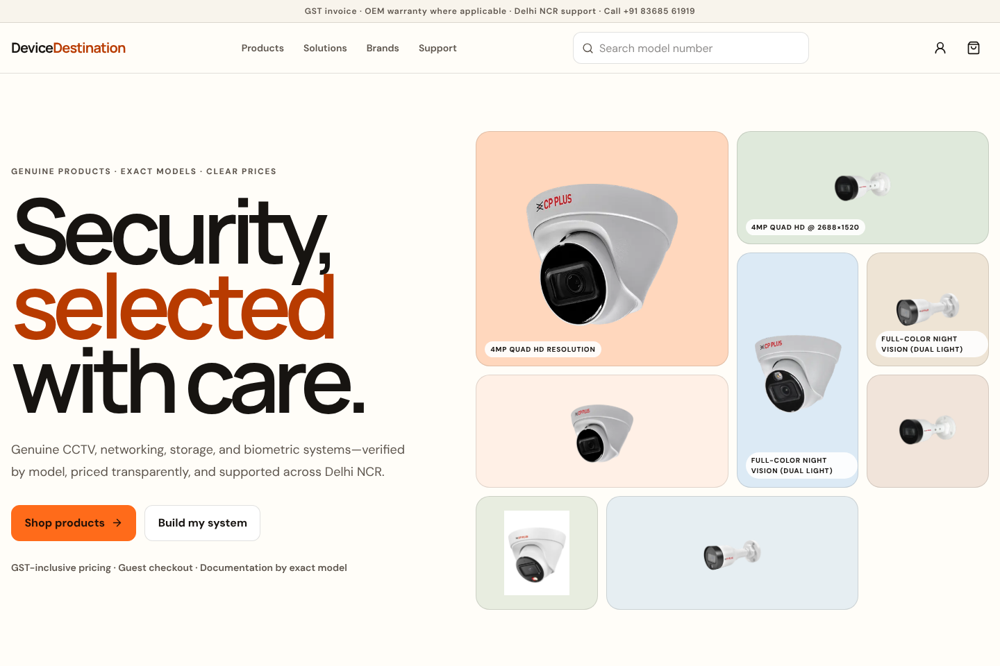
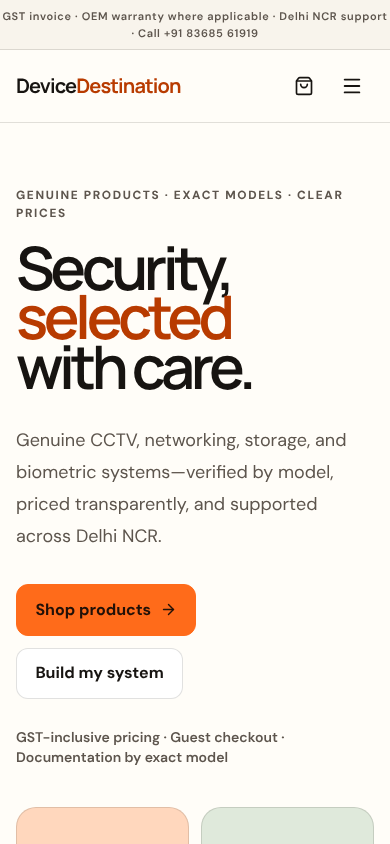

# DeviceDestination

Production-oriented ecommerce for CCTV, NVR and biometric hardware. The storefront is warm-white and tangerine, model-number-first, GST-safe and designed for buyers who should not need to understand every surveillance acronym before choosing a product.

## Screenshots





## What is implemented

- Editorial responsive homepage, requirement paths and guided CCTV system builder
- 19 preserved existing products with audited exact models and legacy slug redirects
- Searchable/filterable catalogue, category and brand landing pages
- Product JSON-LD, breadcrumbs, metadata, exact-model specifications and downloads
- Persistent ID-only anonymous cart and guest checkout
- Integer-paise pricing, included-GST extraction and no double GST
- Razorpay order, callback signature and webhook signature scaffolding
- Server-confirmed contact and quote workflows with Resend/WhatsApp activation
- Better Auth + Neon account architecture and protected admin gate
- Normalized Drizzle schema, deterministic public seed and product validator
- CSP, HSTS, input validation, rate limiting and secure confirmation tokens
- Unit, Playwright and Axe test foundations

## Stack

Next.js 16, React 19, TypeScript, Tailwind CSS 4, Motion, Radix UI, Zustand, Zod, React Hook Form, Drizzle ORM, Neon, Better Auth, Razorpay, Resend, Upstash, Vitest and Playwright.

## Local setup

```bash
npm install
cp .env.example .env.local
npm run dev
```

Without external credentials the storefront, cart, catalogue, validator and server-confirmed local test checkout work. Production refuses fake payment or enquiry success when the required services are not configured.

## Database

```bash
npm run db:generate
npm run db:migrate
npm run db:seed
```

The public seed excludes confidential supplier cost. Production catalogue reads use Neon when `DATABASE_URL` is configured; the seed catalogue is the safe unconfigured-preview fallback.

## Validation and tests

```bash
npm run lint
npm run typecheck
npm test
npm run products:validate
npm run test:e2e
npm run build
```

## Environment variables

| Group          | Required for production       | Variables                                                                                                                        |
| -------------- | ----------------------------- | -------------------------------------------------------------------------------------------------------------------------------- |
| Database       | Yes                           | `DATABASE_URL`                                                                                                                   |
| Authentication | For accounts/admin            | `BETTER_AUTH_SECRET`, `BETTER_AUTH_URL`, `ADMIN_EMAILS`                                                                          |
| Public URLs    | Yes                           | `NEXT_PUBLIC_SITE_URL`                                                                                                           |
| Razorpay       | For online payment            | `NEXT_PUBLIC_RAZORPAY_KEY_ID`, `RAZORPAY_KEY_ID`, `RAZORPAY_KEY_SECRET`, `RAZORPAY_WEBHOOK_SECRET`                               |
| Email          | For live enquiry/auth mail    | `RESEND_API_KEY`, `EMAIL_FROM`, `SALES_EMAIL`                                                                                    |
| WhatsApp       | Optional notification channel | `WHATSAPP_ACCESS_TOKEN`, `WHATSAPP_PHONE_NUMBER_ID`, `WHATSAPP_TEMPLATE_NAME`, `SALES_WHATSAPP_NUMBER`, `WHATSAPP_GRAPH_VERSION` |
| Rate limiting  | Required at scale             | `UPSTASH_REDIS_REST_URL`, `UPSTASH_REDIS_REST_TOKEN`                                                                             |
| Files          | Optional admin uploads        | `BLOB_READ_WRITE_TOKEN`                                                                                                          |

Never commit `.env.local`.

## Activation order

1. Create Neon, migrate and seed.
2. Configure Better Auth and the production site URL.
3. Add Razorpay test keys and webhook, then exercise success/failure/retry.
4. Verify the Resend domain and WhatsApp template.
5. Run the full validation suite and deploy to Vercel.
6. Replace `needs-review` prices only after current public-price research and MRP evidence.

## Production services

- **Vercel:** import this repository as a new project, add the production variables from `.env.example`, set `NEXT_PUBLIC_SITE_URL`, and run the Neon migration and seed before directing traffic.
- **Razorpay:** begin with test keys and register `/api/webhooks/razorpay`; exercise capture, failure, dismissal, and retry before replacing them with live keys. Only a verified capture webhook marks an order paid.
- **Resend:** verify the sending domain, then configure `RESEND_API_KEY`, `EMAIL_FROM`, and `SALES_EMAIL` for live enquiry and authentication mail.
- **WhatsApp:** approve the notification template, then configure the access token, phone-number ID, template name, Graph version, and sales destination number.
- **Admin:** configure Neon and Better Auth, create a verified account, and add its normalized email address to `ADMIN_EMAILS`. The unconfigured interface is non-mutating.

Detailed steps live in [deployment](docs/deployment.md), [architecture](docs/architecture.md), [security](docs/security.md), [admin guide](docs/admin-guide.md) and [order operations](docs/order-operations.md).

## Source-data rules

Supplier prices, landed costs, private marketplace observations and the internal price-list PDF are confidential and excluded from Git. Exact-model official sources are listed in [public product sources](docs/public-product-sources.md); identity corrections are in [product source audit](docs/product-source-audit.md).

## License

Private business application. No rights to manufacturer product imagery or documentation are transferred by this repository.
